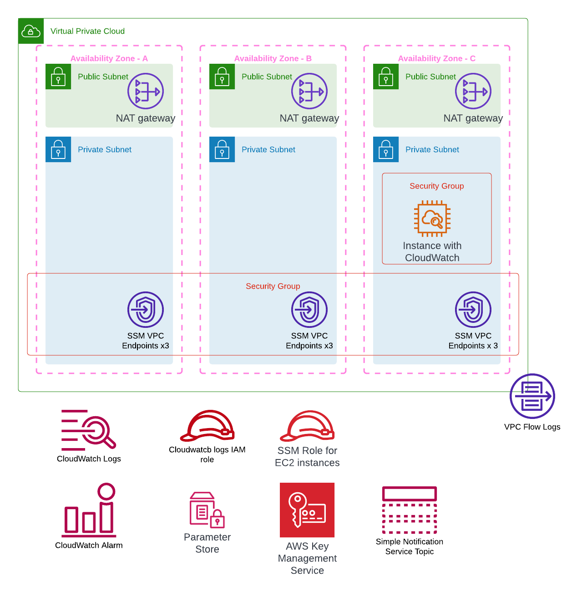

# Overview  

Please see blog site https://devbuildit.com/2023/02/11/monitoring-aws-windows-ec2-instances-with-cloudwatch-part-1/ for detailed explaination of this repo contents.

This repo (and associated blog) will help you to setup an environment on AWS for testing EC2 Windows Instance monitoring.  The base infrastructure is shown below;

# Installation  

Please see https://devbuildit.com/2023/02/11/monitoring-aws-windows-ec2-instances-with-cloudwatch-part-1/ for detailed explaination.

## Requirements:
- AWS Account
- Terraform CLI installed with access to your target AWS account (via temporary Indentity centre credentials or AWS IAM access keys)

## Deployment
- Clone repo into a source folder
- Update file terraform.tfvars to suit your environment
- Run command 'Terraform init' in source folder
- Run command 'Terraform plan' in source folder
- Run command 'Terraform apply' in source folder and approve apply

